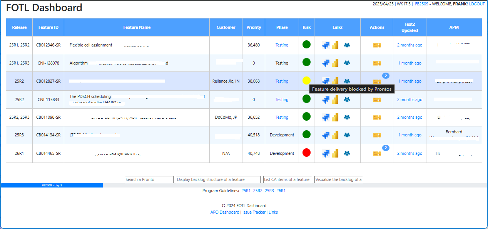
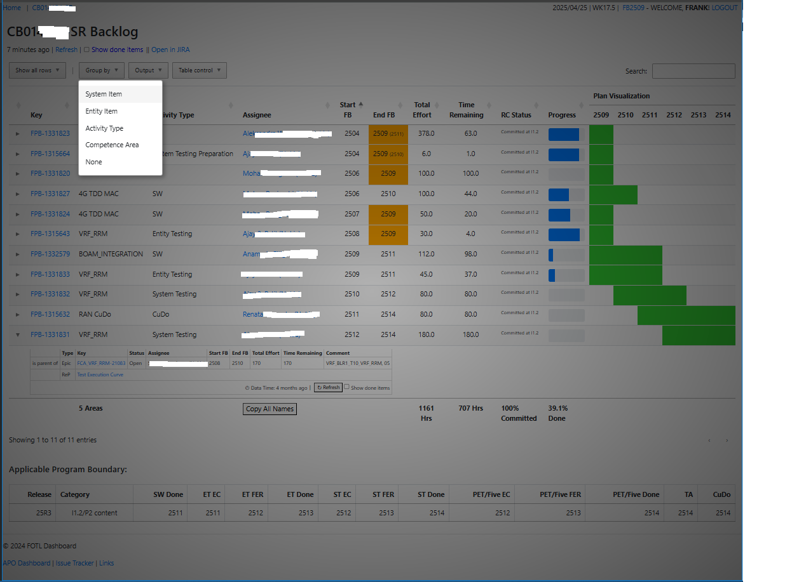

# FOTLead

FOTLead 是一个主要基于 JIRA backlog数据源的辅助项目管理工具，它能多维度可视化呈现项目进度，并能提示进度滞后、延期、剩余工作量异常变动等风险，能极大地方便项目经理统一监控项目进度和风险。它还有项目维度的任务管理、状态填报等功能。(Note: FOT = Feature Owner Team Leader)

## 功能简介

- **FOTL Dashboard**：项目看板，通过表格展示当前项目经理负责的全部项目的重要信息（包括客户/研发阶段/当前风险状态等信息和backlog/task viewer等链接。
  

- **Backlog viewer**：对项目backlog进度进行多粒度、多维度、可视化呈现，提示进度滞后、延期、剩余工作量异常变动等风险信息，还具有多种格式的导出功能。

    

- **Task manager**：项目任务管理，确保件件有着落，事事有回音。
- **Others**：项目测试进度报告（与Reporting Portal集成），项目状态填报（与JIRA集成）等。

## 项目结构

```
FOTLead/
├── fotd/
│ ├── myjira.py # JIRA 数据查询和处理逻辑
│ ├── globals.py # 全局工具函数
│ ├── data.py # 数据模型定义
│ └── ...
├── docs/
│ └── images/ # 项目相关图片
├── tracker/  # 需求跟踪App（可独立使用）
├── link/     # 链接管理App（可独立使用）
├── README.md # 项目说明文档
└── requirements.txt # 项目依赖
```

## 安装步骤

1. 克隆项目到本地：

    ```bash
    git clone https://github.com/your-repo/FOTLead.git
    cd FOTLead

    ```

2. 创建虚拟环境并安装依赖：

    ```bash
     python -m venv venv
     source venv/bin/activate  # Windows 使用 venv\Scripts\activate
     pip install -r requirements.txt

    ```

3. 配置环境变量：

    - 在项目根目录下创建 .env 文件，并添加以下内容：

    ```bash
     AUTH_JIRA_TOKEN=your_token

    ```

4. 运行
    ```bash
     python manage.py runserver
    ```

## 联系方式

如有任何问题，请联系项目维护者：

- 邮箱: 14533348@qq.com
- GitHub: github.com/fanghm

## 许可证

本项目采用 MIT License 开源。
